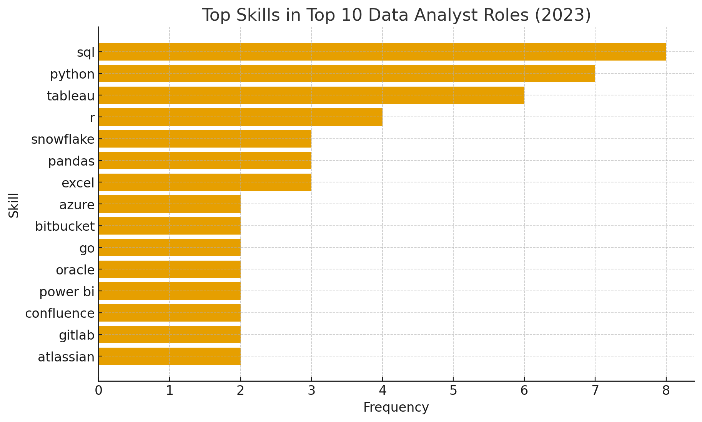

# Introducion
📊 Dive into the data job market! Focusing on data analyst roles, this project explores 💰 top-paying jobs, 🔥 in-demand skills, and 📈 where high demand meets high salary in data analytics.

🔍 SQL queries? Check them out here: [project sql folder](/project_sql/)
# Background
Driven by a quest to navigate the data analyst job market more effectively, this project was born from a desire to pinpoint top-paid and in-demand skills, streamlining others work to find optimal jobs.

Data hails from my [SQL Course](https://www.lukebarousse.com/sql). It's packed with insights on job titles, salaries, locations, and essential skills.

### The questions I wanted to answer through my SQL queries were:

1. What are the top-paying data analyst jobs?
2. What skills are required for these top-paying jobs?
3. What skills are most in demand for data analysts?
4. Which skills are associated with higher salaries?
5. What are the most optimal skills to learn?

# Tools I Used
For my deep dive into the data analyst job market, I harnessed the power of several key tools:

- **SQL:** The backbone of my analysis, allowing me to query the database and unearth critical insights.
- **PostgreSQL:** The chosen database management system, ideal for handling the job posting data.
- **Visual Studio Code:** My go-to for database management and executing SQL queries.
- **Git & GitHub:** Essential for version control and sharing my SQL scripts and analysis, ensuring collaboration and project tracking.

# The Analysis
Each query for this project aimed at investigating specific aspects of the data analyst job market. Here’s how I approached each question:

### 1.Top Paying Data Analyst Jobs
To identify the highest-paying roles, I filtered data analyst positions by average yearly salary and location, focusing on remote jobs. This query highlights the high paying opportunities in the field.

```sql
SELECT
    job_id,
    job_title,
    job_location,
    job_schedule_type,
    salary_year_avg,
    job_posted_date,
    name AS company_name
FROM
    job_postings_fact
LEFT JOIN company_dim ON job_postings_fact.company_id = company_dim.company_id
WHERE
    job_title_short = 'Data Analyst' AND
    job_location = 'Anywhere' AND
    salary_year_avg IS NOT NULL
ORDER BY 
    salary_year_avg DESC
LIMIT 10;
```
#### Here’s a clear and structured insight analysis of the Top-Paying Data Analyst Jobs (2023)
* **Avg Salary:** ₹2.44L/year | Highest: ₹6.5L (Mantys) | Lowest: ₹1.84L (Get It Recruit)

* **Top Roles:** Data Analyst, Principal/Director of Analytics — senior roles earn 2–3× more.

* **Top Companies:** Mantys, Meta, AT&T, Pinterest, SmartAsset.

* **Work Type:** 100% Full-time, mostly remote/hybrid.

* **Trend:** Consistent hiring throughout 2023 → strong market demand.

* **Key Skill Focus:** Leadership + Data strategy + Technical analytics.

### 2. Skills for Top Paying Jobs
To understand what skills are required for the top-paying jobs, I joined the job postings with the skills data, providing insights into what employers value for high-compensation roles.

```sql
WITH top_paying_jobs AS(

    SELECT
        job_id,
        job_title,
        salary_year_avg,
        name AS company_name
    FROM
        job_postings_fact
    LEFT JOIN company_dim ON job_postings_fact.company_id = company_dim.company_id
    WHERE
        job_title_short = 'Data Analyst' AND
        job_location = 'Anywhere' AND
        salary_year_avg IS NOT NULL
    ORDER BY 
        salary_year_avg DESC
    LIMIT 10
)

SELECT 
    top_paying_jobs.*,
    skills
FROM top_paying_jobs
INNER JOIN skills_job_dim ON top_paying_jobs.job_id = skills_job_dim.job_id
INNER JOIN skills_dim ON skills_job_dim.skill_id = skills_dim.skill_id
ORDER BY
    salary_year_avg DESC    
```
### 🔹 Top Skills in Demand

| 🏆 **Rank** | 💡 **Skill**                                                                                         | 📊 **Frequency** |
| :---------: | ---------------------------------------------------------------------------------------------------- | :--------------: |
| I           | **SQL**                                                                                              | 8                |
| II          | **Python**                                                                                           | 7                |
| III         | **Tableau**                                                                                          | 6                |
| IV          | **R**                                                                                                | 4                |
| V           | **Snowflake**, **Pandas**, **Excel**                                                                 | 3 each           |
| VI          | **Azure**, **Bitbucket**, **Go**, **Oracle**, **Power BI**, **Confluence**, **GitLab**, **Atlassian** | 2 each           |

Here’s the bar chart showing the most in-demand skills among the top 10 data analyst roles (2023).
<p align="center">
  
</p>

#### Here's the breakdown of the most demanded skills for the top 10 highest paying data analyst jobs in 2023:

* **SQL and Python** dominate the landscape — they are must-have skills for almost every top-paying data analyst role.
* **Tableau** is the most demanded visualization tool, followed by **Power BI**.
* **R** still holds relevance, mainly for statistical analysis.
* **Cloud and collaboration tools** (Azure, Snowflake, Bitbucket, GitLab, Atlassian) show that data roles increasingly involve **data engineering and teamwork** aspects.
* **Excel** remains valuable despite newer tools — it’s still a strong baseline skill.

### 3. In-Demand Skills for Data Analysts

This query helped identify the skills most frequently requested in job postings, directing focus to areas with high demand.

```sql
SELECT 
    skills,
    COUNT(skills_job_dim.job_id) AS demand_count
FROM job_postings_fact
INNER JOIN skills_job_dim ON job_postings_fact.job_id = skills_job_dim.job_id
INNER JOIN skills_dim ON skills_job_dim.skill_id = skills_dim.skill_id
WHERE
    job_title_short = 'Data Analyst'
    -- AND job_work_from_home = TRUE
GROUP BY
    skills
ORDER BY
    demand_count DESC

LIMIT 5;
```

here are the key insights into the most sought-after skills for data analyst roles:

## 📊 Top Data Analyst Skill Insights

The data clearly indicates that traditional database and spreadsheet tools, along with fundamental programming, are the **highest-demand skills** for data analysts.

| Rank | Skill | Demand Count | Insight |
| :---: | :--- | :---: | :--- |
| **1** | **SQL** | 92,628 | **The Foundational Skill:** SQL is nearly 40% more in demand than the next skill, highlighting its critical role as the **primary language** for querying and managing data. |
| **2** | **Excel** | 67,031 | **The Universal Tool:** Excel remains highly relevant. Its strong demand suggests a need for analysts who can handle quick, ad-hoc analysis and simple reporting for non-technical stakeholders. |
| **3** | **Python** | 57,326 | **The Automation/Advanced Analysis Tool:** Python is the most demanded programming language, indicating a clear need for skills in **data manipulation, statistics, and automation** beyond simple database queries. |
| **4** | **Tableau** | 46,554 | **Leading Visualization Tool:** Tableau leads the dedicated data visualization tools, showing that employers highly value analysts who can translate complex data into **interactive, visual dashboards**. |
| **5** | **Power BI** | 39,468 | **Microsoft Ecosystem Demand:** Power BI's strong presence reflects the prevalence of the **Microsoft ecosystem** in enterprise environments, offering a robust alternative to Tableau for reporting. |

---

### Key Takeaways for Aspiring Analysts:

*  **SQL is Non-Negotiable:** If you are pursuing a career in data analysis, **mastering SQL is the most important step**, as it is a requirement in over **92,000 job postings** in this sample.

* **Focus on the Core Triangle:** The three pillars of high-demand skills are **Database (SQL), Spreadsheet (Excel), and Programming (Python)**. Excelling in these three areas provides the broadest range of job opportunities.

* **Visualization is Essential:** The combined demand for Tableau and Power BI ($\sim 86,000$) underscores the fact that analysts are not just expected to process data, but also to effectively **communicate insights** visually.

### 4. Skills Based on Salary
Exploring the average salaries associated with different skills revealed which skills are the highest paying.

```sql
SELECT 
    skills,
    ROUND(AVG(salary_year_avg), 0) AS avg_salary
FROM job_postings_fact
INNER JOIN skills_job_dim ON job_postings_fact.job_id = skills_job_dim.job_id
INNER JOIN skills_dim ON skills_job_dim.skill_id = skills_dim.skill_id
WHERE
    job_title_short = 'Data Analyst'
    AND salary_year_avg IS NOT NULL
    AND job_work_from_home = TRUE
GROUP BY
    skills
ORDER BY
    avg_salary DESC
LIMIT 25;
```

Here are the core insights into the highest-paying skills for data analysts.

---

### 🚀 Top 3 High-Paying Skill Trends

* **Big Data Engineering is King:** The highest salaries are driven by skills like **PySpark** ($\$208k$), **Databricks**, and **Scala**, indicating that roles requiring the ability to build and manage large-scale, distributed data processing pipelines (i.e., data engineering) command the biggest premium.
* **MLOps and DevOps Expertise is Essential:** High compensation is strongly associated with software development and operations practices, proven by the high pay for skills like **Bitbucket**, **Kubernetes**, **Airflow**, and **Jenkins**, which productionize models and automate complex data workflows.
* **Deep Specialization Pays Out:** Beyond basic programming, top salaries are awarded for expertise in specific, advanced tools like the Python libraries **Pandas** and **NumPy** ($\sim\$150k$), as well as niche technologies like NoSQL databases (e.g., **Couchbase**) and specific cloud platforms (**GCP**).


Here is the list of top-paying skills categorized by domain:

## 💰 Top-Paying Data Analytics Skills by Category

| Skill Category | Key Skills Included | Average Salary | Top-Earning Skill |
| :--- | :--- | :---: | :--- |
| **1. Big Data/Distributed Processing** | PySpark, Databricks, Scala | **\$158,327** | **PySpark** ($\$208,172$) |
| **2. Programming & Core ML Libraries** | Pandas, NumPy, Swift, Go, Watson, Scikit-learn, Jupyter, DataRobot | **\$148,580** | **Watson** ($\$160,515$) |
| **3. DevOps/MLOps & Infrastructure** | Bitbucket, GitLab, Kubernetes, Airflow, Jenkins, Linux, Twilio, GCP | **\$137,986** | **Bitbucket** ($\$189,155$) |
| **4. Data Storage & BI/DW** | Couchbase, Elasticsearch, PostgreSQL, MicroStrategy | **\$137,753** | **Couchbase** ($\$160,515$) |

***

### Visualizing the Salary Trend

The table confirms the earlier insight: the premium for data analysts shifts heavily toward **Data Engineering** and **Advanced Machine Learning** roles that operate at a large scale.

* **Big Data Pays the Most:** The highest overall average salary belongs to the **Big Data/Distributed Processing** group, with PySpark being the single highest-paying skill on the entire list. This demonstrates a clear industry value placed on analysts who can handle and manipulate *massive* datasets.
* **Coding is Crucial:** The **Programming & Core ML Libraries** group secured the second-highest average salary. This highlights that deep expertise in core analytical/ML coding (Pandas, NumPy) and proficiency in high-performance languages (Swift, Go) is vital for maximizing earning potential.
* **Infrastructure Skills Remain Strong:** **DevOps/MLOps** skills, which involve automating, version-controlling, and deploying data projects (Bitbucket, Kubernetes, Airflow), constitute a large portion of the list and remain highly compensated, averaging nearly **\$138k**.

### 5. Most Optimal Skills to Learn

Combining insights from demand and salary data, this query aimed to pinpoint skills that are both in high demand and have high salaries, offering a strategic focus for skill development.

```sql
SELECT 
    skills_dim.skill_id,
    skills_dim.skills,
    COUNT(skills_job_dim.job_id) AS demand_count,
    ROUND(AVG(job_postings_fact.salary_year_avg), 0) AS avg_salary
FROM job_postings_fact
INNER JOIN skills_job_dim ON job_postings_fact.job_id = skills_job_dim.job_id
INNER JOIN skills_dim ON skills_job_dim.skill_id = skills_dim.skill_id
WHERE
    job_title_short = 'Data Analyst'
    AND salary_year_avg IS NOT NULL
    AND job_work_from_home = True 
GROUP BY
    skills_dim.skill_id
HAVING
    COUNT(skills_job_dim.job_id) > 10
ORDER BY
    avg_salary DESC,
    demand_count DESC
LIMIT 25;
```
Here’s a **concise and clear analysis** of the data you provided — summarizing the **most optimal skills for Data Analysts in 2023** 👇

---

### 📊 **Insights: Optimal Data Analyst Skills (2023)**

#### 🔹 **Top High-Paying Skills**

| Skill          | Avg Salary (USD) | Demand |
| -------------- | ---------------- | ------ |
| **Go**         | 💰115,320        | 27     |
| **Confluence** | 💰114,210        | 11     |
| **Hadoop**     | 💰113,193        | 22     |
| **Snowflake**  | 💰112,948        | 37     |
| **Azure**      | 💰111,225        | 34     |
| **BigQuery**   | 💰109,654        | 13     |
| **AWS**        | 💰108,317        | 32     |

💡 *Insight:* Cloud and big data skills (like **Snowflake, Azure, AWS, Hadoop**) offer some of the **highest average salaries** — great for data analysts aiming to move toward **data engineering or cloud analytics**.

---

#### 🔹 **Most In-Demand Skills**

| Skill         | Demand Count | Avg Salary (USD) |
| ------------- | ------------ | ---------------- |
| **Python**    | 236          | 💰101,397        |
| **Tableau**   | 230          | 💰99,288         |
| **R**         | 148          | 💰100,499        |
| **SAS**       | 63           | 💰98,902         |
| **Looker**    | 49           | 💰103,795        |
| **Snowflake** | 37           | 💰112,948        |

💡 *Insight:* **Python, Tableau, and R** dominate demand — these are *must-have core skills* for any data analyst. Tools like **Looker** and **Snowflake** add strong career leverage.

---

#### 🔹 **Balanced (High-Demand + High-Pay) Skills**

| Skill          | Demand | Salary (USD) |
| -------------- | ------ | ------------ |
| **Python**     | ⭐ 236  | 101K         |
| **Tableau**    | ⭐ 230  | 99K          |
| **Snowflake**  | ⭐ 37   | 113K         |
| **Azure**      | ⭐ 34   | 111K         |
| **AWS**        | ⭐ 32   | 108K         |
| **SQL Server** | ⭐ 35   | 97K          |

💡 *Optimal Career Stack:*
→ **Python + SQL + Tableau + Cloud (AWS/Azure/Snowflake)** gives the **best mix** of *job demand*, *high pay*, and *career growth potential*.

---


# What I Learned

Throughout this adventure, I've turbocharged my SQL toolkit with some serious firepower:

- **🧩 Complex Query Crafting:** Mastered the art of advanced SQL, merging tables like a pro and wielding WITH clauses for ninja-level temp table maneuvers.
- **📊 Data Aggregation:** Got cozy with GROUP BY and turned aggregate functions like COUNT() and AVG() into my data-summarizing sidekicks.
- **💡 Analytical Wizardry:** Leveled up my real-world puzzle-solving skills, turning questions into actionable, insightful SQL queries.

# Conclusions

### Insights
From the analysis, several general insights emerged:

1. **Top-Paying Data Analyst Jobs**: The highest-paying jobs for data analysts that allow remote work offer a wide range of salaries, the highest at $650,000!
2. **Skills for Top-Paying Jobs**: High-paying data analyst jobs require advanced proficiency in SQL, suggesting it’s a critical skill for earning a top salary.
3. **Most In-Demand Skills**: SQL is also the most demanded skill in the data analyst job market, thus making it essential for job seekers.
4. **Skills with Higher Salaries**: Specialized skills, such as SVN and Solidity, are associated with the highest average salaries, indicating a premium on niche expertise.
5. **Optimal Skills for Job Market Value**: SQL leads in demand and offers for a high average salary, positioning it as one of the most optimal skills for data analysts to learn to maximize their market value.

### Closing Thoughts

This project enhanced my SQL skills and provided valuable insights into the data analyst job market. The findings from the analysis serve as a guide to prioritizing skill development and job search efforts. Aspiring data analysts can better position themselves in a competitive job market by focusing on high-demand, high-salary skills. This exploration highlights the importance of continuous learning and adaptation to emerging trends in the field of data analytics.